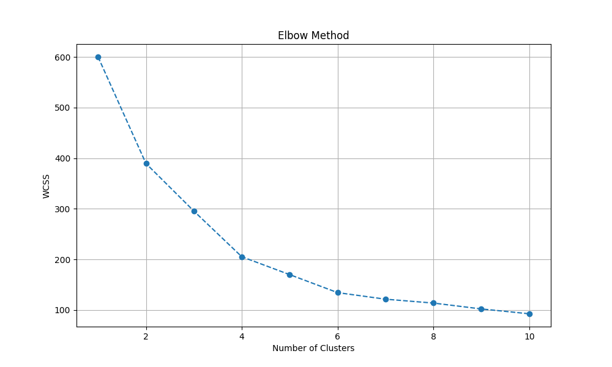
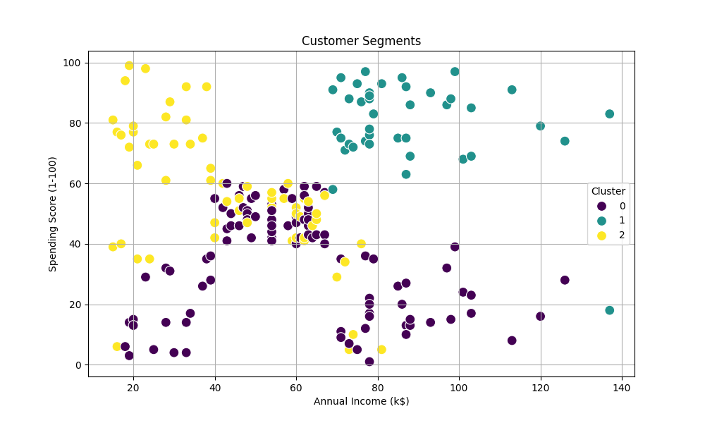

# Customer Segmentation Project

This project uses K-Means clustering to group customers based on their purchase behavior, such as age, annual income, and spending score.

## Features:
- Clusters customers using the **K-Means algorithm**.
- Determines the optimal number of clusters using the **Elbow Method**.
- Visualizes customer segments for better business understanding.

## Project Structure:
```
Customer-Segmentation-Project/
├── customer_segmentation.py   # Main Python script
├── customer_data.csv          # Dataset file
├── README.md                  # Project documentation
└── images/                    # Folder containing output images
    ├── elbow_method.png
    ├── cluster_plot.png
    └── clustered_data.csv
```

## Steps:
1. **Load Dataset:** Load and explore the customer data.
2. **Preprocess Data:** Standardize features like age, annual income, and spending score.
3. **Elbow Method:** Find the optimal number of clusters.
4. **K-Means Clustering:** Apply the K-Means algorithm to assign customers to clusters.
5. **Visualization:** Plot clusters to interpret results.

## Output Visualizations:

### 1. Elbow Method
The Elbow Method helps identify the optimal number of clusters for K-Means.



### 2. Customer Segmentation
The scatter plot shows customer segments based on annual income and spending score.



## Requirements:
- Python 3.x
- Libraries: pandas, numpy, matplotlib, seaborn, scikit-learn

## How to Run:
1. Clone the repository:
   ```bash
   git clone https://github.com/your-username/Customer-Segmentation-Project.git
   ```
2. Navigate to the project directory:
   ```bash
   cd Customer-Segmentation-Project
   ```
3. Install required libraries:
   ```bash
   pip install -r requirements.txt
   ```
4. Run the script:
   ```bash
   python customer_segmentation.py
   ```

